# 线境：月夜追迹 v0.3.1 浏览器验收

验收日期：2026-08-20。

## 测试矩阵

| 场景 | 环境 | 操作 | 结果 |
| --- | --- | --- | --- |
| AI、关卡与任务图回归 | Node.js 22 Type Stripping | `npm run test:ai` | 14/14通过 |
| 类型检查 | TypeScript strict | `npx tsc --noEmit` | 通过 |
| 生产构建 | Vite 6.4.3 | `npm run build` | 通过；641.96 kB / gzip 170.23 kB，存在大Chunk提醒 |
| 首次教学 | Chromium / WebGL2 | 打开`?tutorial=1` | 世界目标、移动、嗅闻、追逐、扑击、吠叫和挖掘均有中文说明 |
| 教学关闭与重开 | Chromium / WebGL2 | 点击“开始追踪”，再点“玩法说明” | 当前目标持续可见，完整教学可以重开 |
| 玩家开放边界 | Chromium / WebGL2 | 持续按住Shift+D | 玩家从x=0移动到x=212.7，未被原x=13任务边界截断 |
| 动物导航边界 | 纯函数验证 | 同一越界目标分别用于动物/玩家 | 动物被约束，玩家保持目标坐标 |
| 中文文案完整性 | 任务图纯函数 | 遍历所有状态、标题、故事和动作 | 所有玩家可见任务节点均含中文文案 |
| 带走分支 | Chromium / WebGL2 | 点击“带走·恢复灯火” | 进入`hunt.resolved.take`并显示中文结果 |
| 数据关卡 | 纯函数验证 | 唯一ID、出生点、洞口、导航边 | `valid=true`，兔子逃生与引路路线均存在 |
| 碰撞与避障 | 纯函数验证 | 将狗半径推入树代理；兔子直冲岩石 | 不穿透；提前产生侧向绕行并保持前进 |
| 首屏 | Chromium 1258×622 / WebGL2 | 打开 `?fixture=close` | 标题、Canvas、HUD、线稿世界正常 |
| 嗅闻 | 桌面键盘 | 按住Q 500ms | 阶段进入 `stalk`，动态气味轨迹可见 |
| 追逐与扑击 | 确定性直线夹具 | Shift+W后Space | 进入 `choice`，两个结果按钮出现并可聚焦 |
| 放生与存档 | 选择夹具 | 点击RELEASE并刷新普通入口 | `released=1`、`markedRabbit=true`、`guidePending=true`保持 |
| 跨局重逢 | Chromium / WebGL2 | 放生后进入下一局 | 兔子`role=guide`，HUD显示记得玩家，离远后等待 |
| 引路完成 | 确定性终点夹具 | 到达螺旋记忆地点 | `guidePending=false`、`reunions=1`，出现围巾故事面板 |
| 中文任务图 | Chromium / WebGL2 | 放生并刷新普通入口 | `hunt.choice → hunt.resolved.release → bond.reunion → bond.guided` |
| 逃脱 | 直线洞穴夹具 | 进入追逐后不追赶 | 兔子进入 `escaped`，出现TRACK AGAIN按钮 |
| 响应式结果面板 | 390×844 | 引路完成面板 | 无横向溢出，继续按钮可访问 |
| 减少动态效果 | 390×844 | 模拟`prefers-reduced-motion` | 媒体查询命中，UI过渡与低能量动画关闭 |
| 运行错误 | Chromium | `errors` / `console` | 无页面错误；只有上游`THREE.Clock`弃用警告 |

## 关键快照

### 初始狩猎HUD

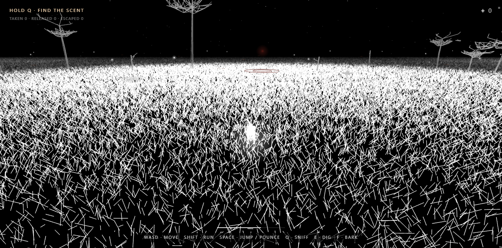

### 嗅闻与动态轨迹

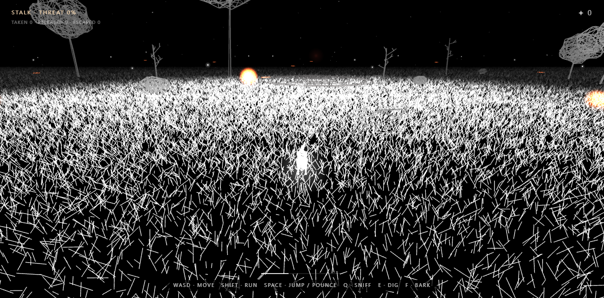

### 捕获选择

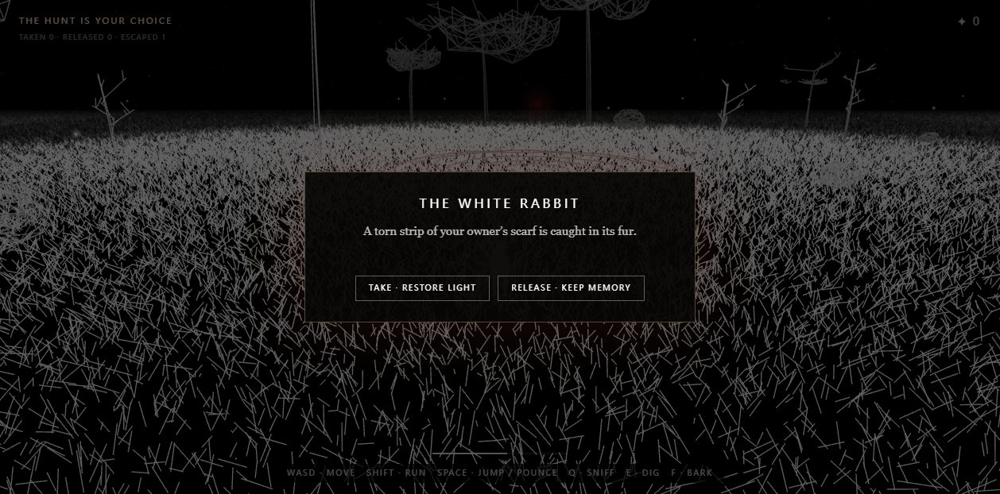

### 兔子逃脱

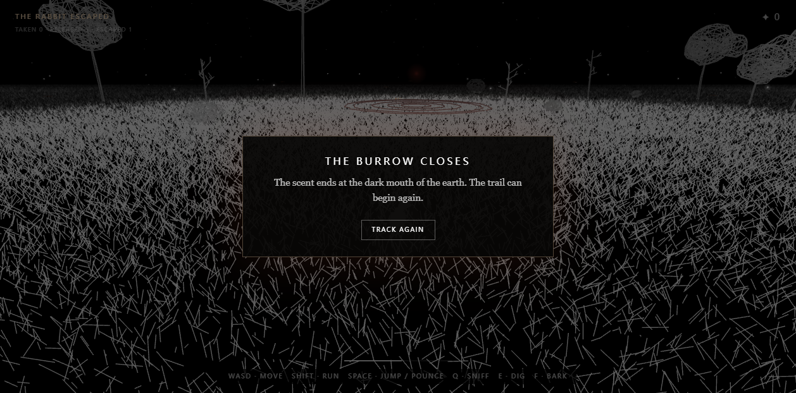

### 移动端结果面板

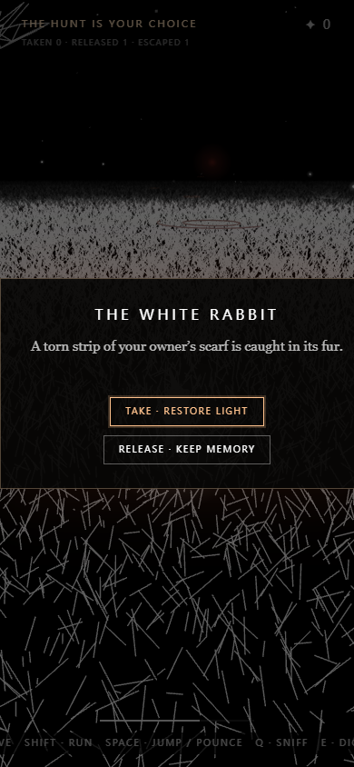

### 数据化碰撞走廊

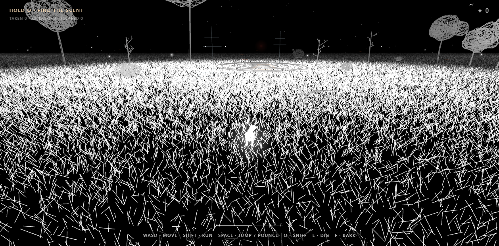

### 放生兔子跨局重逢

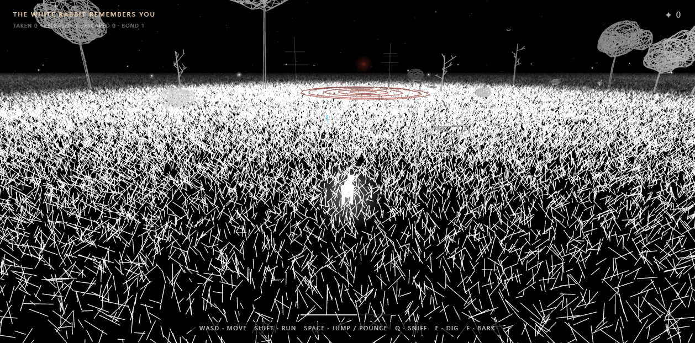

### 引路后的围巾记忆

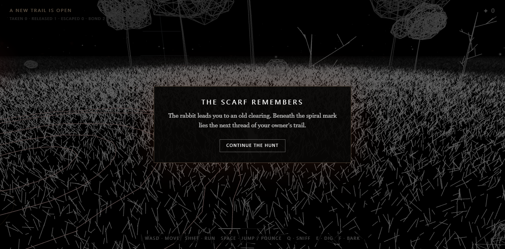

### 移动端引路结果

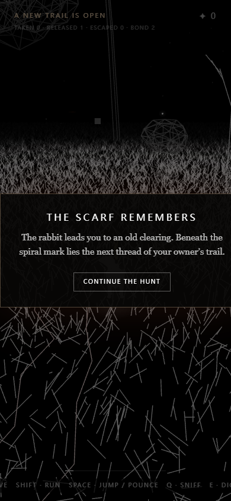

### 中文捕获选择

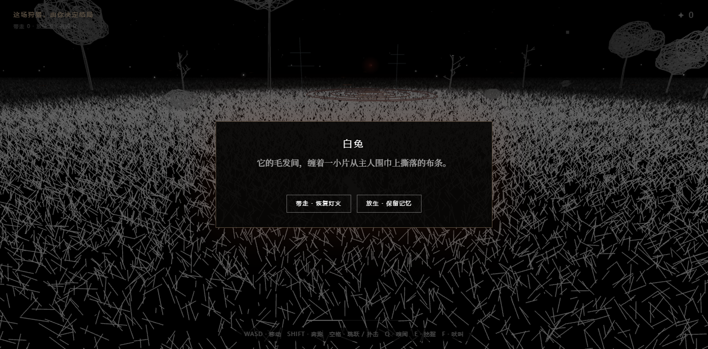

### 中文移动端引路结果

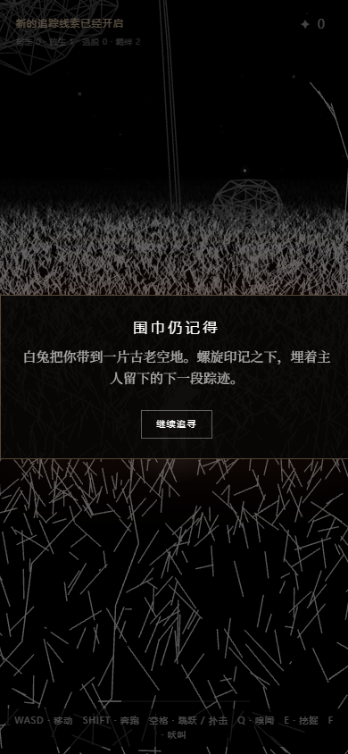

### 桌面端首次教学

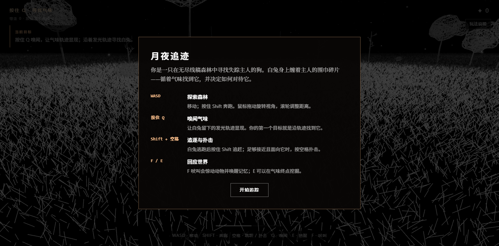

### 手机端首次教学

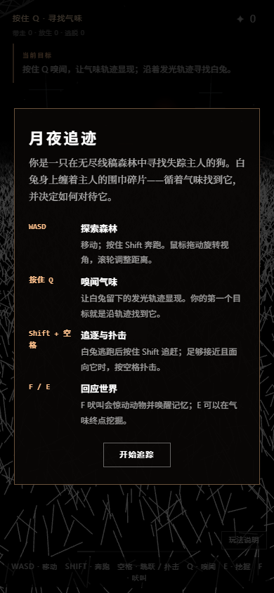

## 已修复的回归

1. `burrowing` 被洞穴高优先级判断持续覆盖，导致永远无法进入 `escaped`。已将洞穴进入条件限制为 `fleeing/juking → burrowing`。
2. 狗停止追赶后，“远离狗”和“返回洞穴”权重接近，兔子可能横向无限奔跑。已改为近距离优先闪避、远距离优先回洞。
3. 捕获后调试快照仍显示上一帧 `fleeing`。已让快照读取当前终止状态，并在结果阶段清除扑击提示。
4. 初始导航锚点虽然有连边，但其中一段与树碰撞代理相交。已移动`west-gate`并让测试断言实际线段净空，而非只检查图连通。
5. 局部避障在正面接近岩石时可能产生向后速度。已给组合方向增加最小前向投影，保持绕行仍有进度。

## 尚未覆盖

- 真实触屏移动和动作输入。
- 上游随机Chunk中的全部树木/岩石碰撞，以及地形高度、坡面和动态障碍。
- 长时生态、第二类任务动物和跨Chunk持久实体。
- WebGL失败回退、暂停、设置和存档迁移。
- 真实移动GPU性能矩阵。
