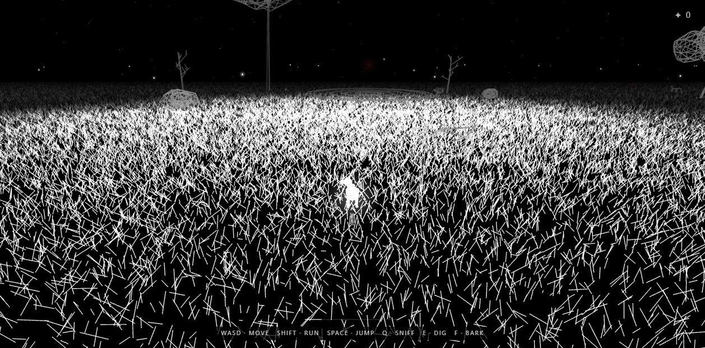
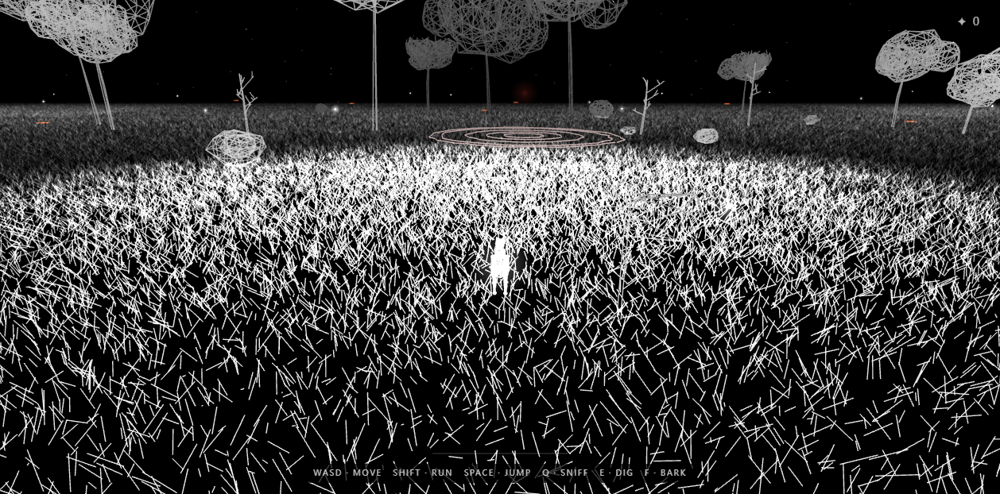

# Lineworld 本地演示与验证

此目录保存 [muratkamci/Lineworld](https://github.com/muratkamci/Lineworld) 的本地运行说明和浏览器验证截图。上游完整源码位于 `vendor-projects/Lineworld`，保持为独立 Git 仓库；本目录不复制其源码。

- 在线衍生原型：[线境：月夜追迹](https://yydshly.github.io/0819_githubcode_study/lineworld-night-hunt/)
- [完整研究结论](../../studies/lineworld/README.md)
- [技术原理](../../studies/lineworld/technical-principles.md)

## 本地运行

```powershell
cd E:\0819_codex_project\vendor-projects\Lineworld
npm install
npm run dev -- --host 127.0.0.1
```

浏览器打开 <http://127.0.0.1:5173/>。

生产构建：

```powershell
npm run build
npm run preview
```

## 操作

| 输入 | 行为 |
| --- | --- |
| WASD / 方向键 | 移动 |
| Shift | 奔跑 |
| Space | 跳跃 |
| Q | 嗅闻并显示气味路径 |
| E | 在标记位置挖掘 |
| F | 吠叫、推开雾、惊动动物并唤醒附近地标 |
| 鼠标拖动 / 滚轮 | 环绕 / 缩放相机 |

## 验证结果

- `npm install`：通过，0 个已知漏洞。
- `npm run build`：通过；JS 约 612.39 kB，gzip 约 161.01 kB，存在单 Chunk 体积提醒。
- Chromium：页面标题、HUD、WebGL2 Canvas 和 Shader 正常；无页面错误或 Vite 错误覆盖层。
- 控制台：仅观察到 `THREE.Clock` 的弃用警告。
- 自动交互：Q 嗅闻、W 前进和 F 吠叫已实际触发。

## 截图

初始运行：



嗅闻、前进和吠叫后；画面中央前方可见吠叫同心波纹：



## 研究入口

- [完整能力分析](../../studies/lineworld/README.md)
- [上游版本锁](../../studies/lineworld/upstream-lock.json)
- [上游 MIT 许可证](../../vendor-projects/Lineworld/LICENSE)
