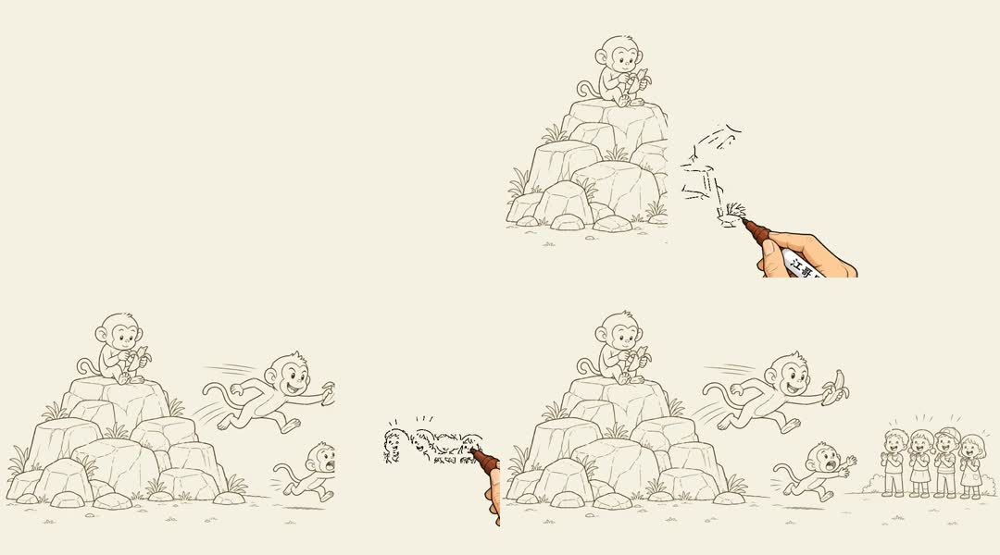

# SRT Whiteboard Animation 复现演示

本目录保存对上游 `geeklee/srt-whiteboard-animation` 提交 `696a7243c0e6ffb6827676e539c2ca5ebae2bf6b` 的本地复现证据。

## 项目简介

这是一个可控的静态插画转白板动画方案。OpenCV 识别图片中的墨迹像素，将墨迹细化并转换为坐标路径；程序根据区域时间和几何落笔规则逐帧移动画笔、更新累计遮罩，先显示黑白线稿，再把彩色原图刷回，最后通过 OpenCV 与 FFmpeg 输出 MP4。透明画手只是跟随当前坐标的视觉覆盖层，不是生成墨迹的主体。

它适合静态插画、教学图解、流程说明和轻量故事画面；不适合写实照片、复杂交叉线稿、要求严格汉字笔顺或真实手绘动力学的内容。

## 原理速览

```text
彩色源图
  ├─ OpenCV 灰度化/阈值化 → 黑白墨迹
  └─ 保留原始彩色像素   → 彩色图层

黑白墨迹 → 骨架化 → 坐标路径 → 落笔排序
                                     ↓
annotation.json → 区域/开始时间/时长 → 逐帧累计遮罩
                                     ↓
                     先揭示黑白墨迹，再刷回彩色原图
                                     ↓
                         画手 PNG 跟随当前坐标
                                     ↓
                            VideoWriter + FFmpeg
                                     ↓
                                H.264 MP4
```

完整的像素、路径、遮罩、黑白/彩色两阶段和画手覆盖原理见[研究记录](../../studies/srt-whiteboard-animation/README.md#详细实现原理)。

## 研究 Web

研究页将真实视频、驱动参数、实时 CLI/annotation 预览、使用场景与能力边界放在同一页面：

在线演示：<https://yydshly.github.io/0819_githubcode_study/srt-whiteboard-animation/>

```powershell
node demos\srt-whiteboard-animation\serve.cjs 8879
```

打开 <http://127.0.0.1:8879/demos/srt-whiteboard-animation/>。该轻量服务器支持 MP4 Range 请求，因此四个阶段按钮可以精确跳转；页面本身仍是零构建依赖的静态 HTML/CSS/JS。

页面中的“案例流程”现有四个实际案例：

| 案例 | 用途 | 渲染组合 | 实际输出 |
| --- | --- | --- | --- |
| 猴子抢香蕉 | 故事叙事 | `grid + contour-wipe + hand` | 8.6 秒 |
| 光合作用 | 知识解释 | `skeleton + contour-wipe + hand` | 9.1 秒 |
| 从想法到交付 | 流程说明 | `grid + brush + bare-tip` | 9.6 秒 |
| 火箭为什么升空 | 物理解释 | `skeleton + brush + hand` | 10.0 秒 |

选择案例后可按 `SRT → 源图 → 标注 → 渲染 → 成片` 打开全部真实工件。

## 直接查看

- [复现视频](monkey-banana-reproduced.mp4)：由上游示例 PNG 与 `annotation.json` 在本机重新渲染，并非复制上游预生成视频。
- [GIF 快速预览](monkey-banana-reproduced.gif)：由本机复现视频转换，便于直接查看完整效果。
- [四阶段时间线](timeline-contact-sheet.jpg)：0.1、3.2、6.0、8.5 秒的画面状态。
- [区域标注预览](annotation-preview.png)：左侧场景、中间主体、右侧反应三个叙事区域。
- [SRT 输入样例](sample.srt)：用于验证字幕解析与场景分组。
- [SRT 解析结果](parsed-scenes.json)：短时长参数下被稳定拆成三个场景。



## 已验证输出

| 属性 | 结果 |
| --- | --- |
| 视频编码 | H.264 High / yuv420p |
| 分辨率 | 1080 × 600 |
| 帧率 | 60 FPS |
| 时长 | 8.600 秒 |
| 帧数 | 516 |
| 文件大小 | 1,198,206 bytes |
| SHA-256 | `F036854207DF6A7536A674B0AC655D74CD1F09814B62757F0B97E18074772CBA` |

将本机复现视频与上游参考 MP4 逐帧解码后运行 FFmpeg PSNR 对比，结果为 `average:inf / min:inf / max:inf`，即 516 帧像素完全一致；容器文件的细小字节差异只来自本机 FFmpeg 版本元数据。

## 复现命令

在工作区根目录执行：

```powershell
git clone https://github.com/geeklee/srt-whiteboard-animation.git vendor-projects\srt-whiteboard-animation
cd vendor-projects\srt-whiteboard-animation
python scripts\prepare_env.py

.\.venv\Scripts\python.exe scripts\parse_srt.py ..\..\demos\srt-whiteboard-animation\sample.srt --target-sec 3 --min-sec 2 --max-sec 4

.\.venv\Scripts\python.exe scripts\render_annotation_preview.py examples\scene-01-monkey-mountain-banana.png examples\scene-01-monkey-mountain-banana.annotation.json ..\..\demos\srt-whiteboard-animation\annotation-preview.png

.\.venv\Scripts\python.exe scripts\render_stream_whiteboard.py examples\scene-01-monkey-mountain-banana.png examples\scene-01-monkey-mountain-banana.annotation.json ..\..\demos\srt-whiteboard-animation\monkey-banana-reproduced.mp4 assets\drawing-hand.png --ink-path grid --color-fill contour-wipe
```

新增案例的复现命令（在上游仓库目录执行）：

```powershell
.\.venv\Scripts\python.exe scripts\render_stream_whiteboard.py ..\..\demos\srt-whiteboard-animation\cases\photosynthesis\source.png ..\..\demos\srt-whiteboard-animation\cases\photosynthesis\annotation.json ..\..\demos\srt-whiteboard-animation\cases\photosynthesis\output.mp4 assets\drawing-hand.png --ink-path skeleton --color-fill contour-wipe --total-ms 9000 --fps 60

.\.venv\Scripts\python.exe scripts\render_stream_whiteboard.py ..\..\demos\srt-whiteboard-animation\cases\idea-to-delivery\source.png ..\..\demos\srt-whiteboard-animation\cases\idea-to-delivery\annotation.json ..\..\demos\srt-whiteboard-animation\cases\idea-to-delivery\output.mp4 assets\drawing-hand.png --ink-path grid --color-fill brush --bare-tip --total-ms 9600 --fps 60

.\.venv\Scripts\python.exe scripts\render_stream_whiteboard.py ..\..\demos\srt-whiteboard-animation\cases\newton-third-law\source.png ..\..\demos\srt-whiteboard-animation\cases\newton-third-law\annotation.json ..\..\demos\srt-whiteboard-animation\cases\newton-third-law\output.mp4 assets\drawing-hand.png --ink-path skeleton --color-fill brush --total-ms 10000 --fps 60
```

三张新增源图使用内置图像生成模式制作，提示重点均为：16:9 暖纸面、三个独立大区域、深色连贯轮廓、少量平涂色、无文字/标签/水印，目的是让矩形区域遮罩与笔迹追踪稳定，而不是单纯追求插画复杂度。物理案例进一步限定为发动机燃烧、向下喷气和火箭上升三个互不重叠区域。

## 演示边界

本次验证覆盖 SRT 解析、时长分组、区域标注预览、遮罩顺序、网格笔迹、轮廓上色和 H.264 导出。源图生成、自动语义标注、旁白、字幕烧录与音频混流不属于仓库内置的确定性渲染能力，未在本轮伪装为“一键自动化”。

视频与截图使用上游 MIT 许可示例素材生成；上游版权为 `Copyright (c) 2026 江哥是老登啊`，完整文本见 [UPSTREAM-LICENSE.md](UPSTREAM-LICENSE.md)。

## Web 交付记录

- [设计契约](docs/design-contract.md)
- [浏览器验收](docs/validation.md)
- [交接说明](docs/handoff.md)
